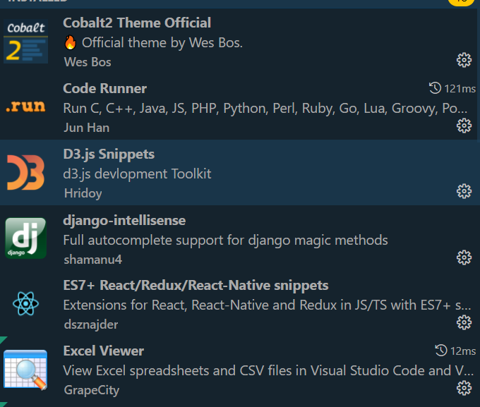

# VSCodeSetup
**Brief Description of my VS Code Setup.**

VSCode became my favorite editor due to its amazing UX, multiple development plugins and wide range of workspace customizations.

## Installation
---
Installation is quick and easy: [Link Here]('https://code.visualstudio.com/')


## Extensions
---
Due to VSCode's large community, you can find a no. of extensions to fit your every need.
In addition to Liveserver, other useful extensions useful for my workspace are as follows:



## Workspace Settings
---
My Workspace settings are as simple as possible to support an efficient workflow. 


### settings.json
```
{
    "python.pythonPath": "python.defaultInterpreterPath",
    "workbench.colorTheme": "Cobalt2",
    "window.zoomLevel": 1,
    "workbench.settings.editor": "json",
    "workbench.settings.openDefaultSettings": true,
    "workbench.editorAssociations": {
        "*.ipynb": "jupyter-notebook"
    },
    "jupyter.interactiveWindowMode": "perFile",
    "terminal.integrated.defaultProfile.windows": "Git Bash",
    "files.autoSave": "afterDelay",
    "files.autoSaveDelay": 3000,
    "search.searchEditor.doubleClickBehaviour": "openLocationToSide",
    "workbench.editor.pinnedTabSizing": "shrink",
    "notebook.cellToolbarLocation": {
        "default": "right",
        "jupyter-notebook": "left"
    },
    "git.autofetch": true,
    "emmet.includeLanguages": {
        "javascript": "javascriptreact"
    }
}
```
